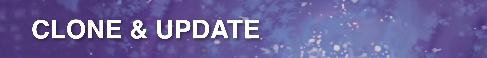
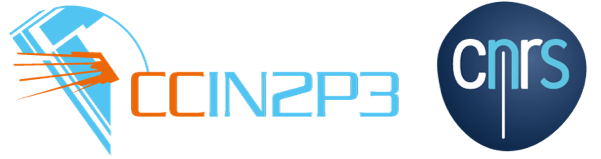
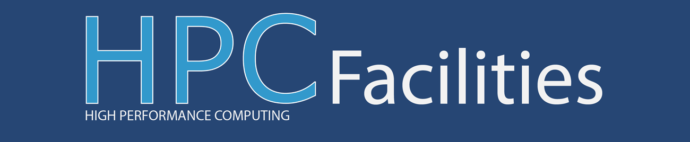
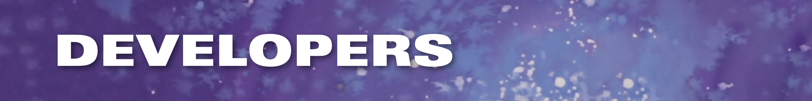

# GUNDAM — 風をあつめて 


[](https://github.com/gundam-organization/gundam/network/members) 
[](https://github.com/gundam-organization/gundam/releases/)
[](https://github.com/gundam-organization/gundam-input-tutorial) 

GUNDAM, standing for *Generalized and Unified Neutrino Data Analysis Methods*,
is a suite of applications which aims at performing various statistical
analysis with different purposes and setups.
It has been developed as a fork of 
[xsllhFitter](https://gitlab.com/cuddandr/xsLLhFitter),
in the context of the Upgrade of ND280 for the T2K neutrino experiment.

The applications are intended to be fully configurable with a set
of YAML/JSON files, as the philosophy of this project is to avoid users
having to put their hands into the code for each study.
A lot of time and efforts are usually invested by various working
groups to debug and optimize pieces of codes which does generic tasks.
As GUNDAM is designed for maximize flexibility to accommodate
various physics works, it allows to share optimizations
and debugging for every project at once.


### There are several requirements for building the fitter:

- CMake 3.12+
- A C++14 enabled compiler
  - Recommended GCC 8+ ( GCC 5 minumim )
  - Recommended Clang 9+ ( Clang 3.4 minimum )
- [ROOT 6, compiled with C++14 or later](https://github.com/root-project/root)
- [JSON for Modern C++](https://github.com/nlohmann/json)
- [yaml-cpp](https://github.com/jbeder/yaml-cpp)
- Optional: zlib

### Shell setup

In this guide, it is assumed you have already defined the following bash environment
variables:

- `$REPO_DIR`: the path to the folder where your git projects are stored. This guide
  will download this repo into the subdirectory `$REPO_DIR/gundam`.

- `$BUILD_DIR`: the path where the binaries are built. As for the previous variables,
  this guide will work under `$BUILD_DIR/gundam`.

- `$INSTALL_DIR`: the path where the binaries are installed and used by the shell.
  Same here: this guide will work under `$INSTALL_DIR/gundam`.

As an example, here is how I personally define those variables. This script is executed
in the `$HOME/.bash_profile` on macOS or `$HOME/.bashrc` on Linux, as they can be used
for other projects as well.

```bash
export WORK_DIR="$HOME/Documents/Work"
export INSTALL_DIR="$WORK_DIR/Install/"
export BUILD_DIR="$WORK_DIR/Build/"
export REPO_DIR="$WORK_DIR/Repositories/"
```

If it's the first time you define those, don't forget to `mkdir`!

```bash
mkdir -p $INSTALL_DIR
mkdir -p $BUILD_DIR
mkdir -p $REPO_DIR
```




### Cloning the source code

GUNDAM source code is officially available under the 
[GUNDAM-organization on GitHub](https://github.com/gundam-organization/gundam).
To copy the code on your computer or cluster, we recommend to use GIT.
We assume 

```bash
cd $REPO_DIR
git clone --recurse-submodules https://github.com/gundam-organization/gundam.git
cd gundam
```

For GUNDAM users, it is recommended for you to check out the latest
tagged version of this repository. A simple bash script allows you to
check out the latest tagged version by tapping:

```bash
./update.sh --latest
```

Note that this command will also automatically check out the submodule
included in the project. Therefore, in order to update your code when
a new release is available, simply use the same command. Note that git versions 
before 2.0 may have issues to checkout the correct submodules (see issue #429)


### Compiling on macOS:

[](./resources/guides/installOnMacOs.md)


### Compiling on CCLyon:

[](./resources/guides/installOnCCLyon.md)


### Compiling on HPC:

[](./resources/guides/installOnHpc.md)


### Compiling on LXPLUS:

[](./resources/guides/installOnLXPLUS.md)


### Alternative installation procedure

```bash
cd $REPO_DIR/gundam
cd cmake/scripts
./gundam-setup.sh
./gundam-build.sh
```

this will create the build directory `gundam-${compiler}_${compiler_version}-${compiler_machine}`.


## How do I use GUNDAM?


[Getting started](./documentation/GettingStarted.md)


## I want to contribute!



### Development policy

- Main development of the code should take place in the main branch.
- Code developments must be discussed with the group before they happen.
- Developments should happen in a feature brach with a name descriptive of the feature you are developing.
- Commit messages must be detailed. This means that messages like "Minor fix" or "Update" must be avoided.
- Pull requests and merge request do not need to be merged by an admin but all the CI tests must be successfull before merging.
- Avoid pull request for a single commit.
- Forks are allowed and the usage of the forked code is regulated by the code license.
- Share of the code is regulated by the code license.

## Lineage & Legacy

GUNDAM was born as a fork of the *xsllhFitter* project which was developped and used by
the cross-section working group of T2K. The original project can be found on *gitlab*:
[https://gitlab.com/cuddandr/xsLLhFitter](https://gitlab.com/cuddandr/xsLLhFitter).

GUNDAM has originally been developed as an new fitter to perform T2K oscillation
analysis, and provide an expandable base on which future studies with the *Upgraded
ND280 Detectors* will be performed.


