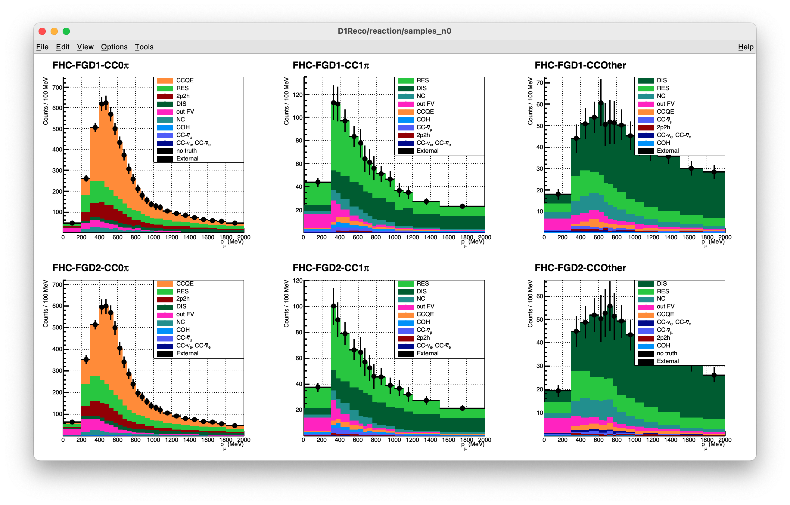
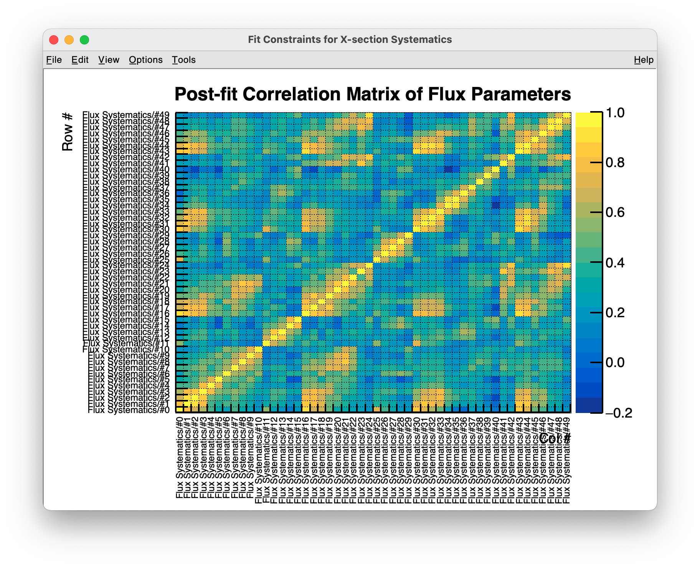

# GUNDAM — 風をあつめて 


[](https://github.com/nadrino/gundamInputOa2020)  [](https://github.com/nadrino/gundam/network/members) [](https://github.com/nadrino/gundam/releases/)

GUNDAM, for *Generic fitter for Upgraded Near Detector Analysis Methods*, is a suite
of applications which aims at performing various statistical analysis with different
purposes and setups. It has been developed as a fork of 
[xsllhFitter](https://gitlab.com/cuddandr/xsLLhFitter), in the context of the Upgrade
of ND280 for the T2K neutrino experiment.


The main framework offers a code structure which is capable of  handling parameters/errors
propagation on a model and compare to experimental data. As an example, GUNDAM includes
a likelihood-based fitter which was initially designed  to reproduce T2K's BANFF fit as
a proof of concept.

The applications are intended to be fully configurable with a set of YAML/JSON files, as
the philosophy of this project is to avoid users having to put their hands into the code
for each study. A lot of time and efforts are usually invested by various working groups
to debug and optimize pieces of codes which does generic tasks. As GUNDAM is designed for
maximize flexibility to accommodate various physics works, it allows to share optimizations
and debugging for every project at once.

## Showcase



<details>
  <summary><b>Spoiler: More Screenshots</b></summary>



</details>


## How do I get setup?

### Prerequisites

There are several requirements for building the fitter:
- GCC 4.8.5+ or Clang 3.3+ (a C++11 enabled compiler)
- CMake 3.5+
- [ROOT 6](https://github.com/root-project/root)
- [JSON for Modern C++](https://github.com/nlohmann/json)
- [yaml-cpp](https://github.com/jbeder/yaml-cpp)

### Shell setup

In this guide, it is assumed you have already defined the following bash environment
variables:

- `$REPO_DIR`: the path to the folder where your git projects are stored. This guide
  will download this repo into the subdirectory `$REPO_DIR/gundam`.

- `$BUILD_DIR`: the path where the binaries are built. As for the previous variables,
  this guide will work under `$BUILD_DIR/gundam`.

- `$INSTALL_DIR`: the path where the binaries are installed and used by the shell.
  Same here: this guide will work under `$INSTALL_DIR/gundam`.

As an example, here is how I personally define those variables. This script is executed
in the `$HOME/.bash_profile` on macOS or `$HOME/.bashrc` on Linux, as they can be used
for other projects as well.

```bash
export WORK_DIR="$HOME/Documents/Work"
export INSTALL_DIR="$WORK_DIR/Install/"
export BUILD_DIR="$WORK_DIR/Build/"
export REPO_DIR="$WORK_DIR/Repositories/"
```

If it's the first time you define those, don't forget to `mkdir`!

```bash
mkdir -p $INSTALL_DIR
mkdir -p $BUILD_DIR
mkdir -p $REPO_DIR
```

### Cloning repository

```bash
cd $REPO_DIR
git clone https://github.com/nadrino/gundam.git
cd $REPO_DIR/gundam
```

As a user, it is recommended for you to check out the latest tagged version of this
repository:

```bash
git checkout $(git describe --tags `git rev-list --tags --max-count=1`)
```

GUNDAM depends on additional libraries which are included as submodules of this git
project. It is necessary to download those:

```bash
git submodule update --init --recursive
```

### Updating your repository

Pull the latest version on github with the following commands:

```bash
cd $REPO_DIR/gundam
git pull
git checkout $(git describe --tags `git rev-list --tags --max-count=1`)
git submodule update --init --recursive
cd -
```


### Compiling on macOS:

[](./resources/guides/installOnMacOs.md)


### Compiling on CCLyon:

[](./resources/guides/installOnCCLyon.md)


### Compiling on HPC:

[](./resources/guides/installOnHpc.md)


### Compiling on LXPLUS: - TO BE DONE

[](./resources/guides/.md)


### Input documentation

[gundamFitter options](./documentation/applications/gundamFitter.md)

## I want to contribute!

## Lineage

GUNDAM was born as a fork of the *xsllhFitter* project which was developped and used by
the cross-section working group of T2K. The original project can be found on *gitlab*:
[https://gitlab.com/cuddandr/xsLLhFitter](https://gitlab.com/cuddandr/xsLLhFitter).

GUNDAM has originally been developed as an new fitter to perform T2K oscillation
analysis, and provide an expandable base on which future studies with the *Upgraded
ND280 Detectors* will be performed.


### Development policy 

- Main development of the code should take place in the master branch.
- Code developments must be discussed with the group before they happen.
- Developments should happen in a feature brach with a name descriptive of the feature you are developing. 
- Commit messages must be detailed. This means that messages like "Minor fix" or "Update" must be avoided.
- Pull requests and merge request do not need to be merged by an admin but all the CI tests must be successfull before merging.
- Avoid pull request for a single commit. 
- Forks are allowed and the usage of the forked code is regulated by the code license. 
- Share of the code is regulated by the code license. 
