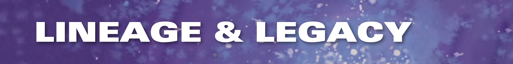

# GUNDAM — 風をあつめて 


[](https://github.com/gundam-organization/gundam/network/members) 
[](https://github.com/gundam-organization/gundam/releases/)
[](https://github.com/gundam-organization/gundam-input-tutorial) 

GUNDAM, standing for *Generalized and Unified Neutrino Data Analysis Methods*,
is a suite of applications which aims at performing various statistical
analysis with different purposes and setups.
It has been developed as a fork of 
[xsllhFitter](https://gitlab.com/cuddandr/xsLLhFitter),
in the context of the Upgrade of ND280 for the T2K neutrino experiment.

The applications are intended to be fully configurable with a set
of YAML/JSON files, as the philosophy of this project is to avoid users
having to put their hands into the code for each study.
A lot of time and efforts are usually invested by various working
groups to debug and optimize pieces of codes which does generic tasks.
As GUNDAM is designed for maximize flexibility to accommodate
various physics works, it allows to share optimizations
and debugging for every project at once.


### There are several requirements for building the fitter:

- CMake 3.12+
- A C++14 enabled compiler
  - Recommended GCC 8+ ( GCC 5 minumim )
  - Recommended Clang 9+ ( Clang 3.4 minimum )
- [ROOT 6, compiled with C++14 or later](https://github.com/root-project/root)
- [JSON for Modern C++](https://github.com/nlohmann/json)
- [yaml-cpp](https://github.com/jbeder/yaml-cpp)


### Shell setup

In this guide, it is assumed you have already defined the following bash environment
variables:

- `$REPO_DIR`: the path to the folder where your git projects are stored. This guide
  will download this repo into the subdirectory `$REPO_DIR/gundam`.

- `$BUILD_DIR`: the path where the binaries are built. As for the previous variables,
  this guide will work under `$BUILD_DIR/gundam`.

- `$INSTALL_DIR`: the path where the binaries are installed and used by the shell.
  Same here: this guide will work under `$INSTALL_DIR/gundam`.

As an example, here is how I personally define those variables. This script is executed
in the `$HOME/.bash_profile` on macOS or `$HOME/.bashrc` on Linux, as they can be used
for other projects as well.

```bash
export WORK_DIR="$HOME/Documents/Work"
export INSTALL_DIR="$WORK_DIR/Install/"
export BUILD_DIR="$WORK_DIR/Build/"
export REPO_DIR="$WORK_DIR/Repositories/"
```

If it's the first time you define those, don't forget to `mkdir`!

```bash
mkdir -p $INSTALL_DIR
mkdir -p $BUILD_DIR
mkdir -p $REPO_DIR
```


### Cloning the source code

GUNDAM source code is officially available under the 
[GUNDAM-organization on GitHub](https://github.com/gundam-organization/gundam).
To copy the code on your computer or cluster, we recommend to use GIT.
We assume 

```bash
cd $REPO_DIR
git clone --recurse-submodules https://github.com/gundam-organization/gundam.git
cd gundam
```

For GUNDAM users, it is recommended for you to check out the latest
tagged version of this repository. A simple bash script allows you to
check out the latest tagged version by tapping:

```bash
./update.sh --latest
```

Note that this command will also automatically check out the submodule
included in the project. Therefore, in order to update your code when
a new release is available, simply use the same command. Note that git versions 
before 2.0 may have issues to checkout the correct submodules (see issue #429)


### Compiling on macOS:

[](resources/doc/guides/installOnMacOs.md)


### Compiling on CCLyon:

[](resources/doc/guides/installOnCCLyon.md)


### Compiling on HPC:

[](resources/doc/guides/installOnHpc.md)


### Compiling on LXPLUS:

[](resources/doc/guides/installOnLXPLUS.md)


### Alternative installation procedure

```bash
cd $REPO_DIR/gundam
cd cmake/scripts
./gundam-setup.sh
./gundam-build.sh
```

this will create the build directory `gundam-${compiler}_${compiler_version}-${compiler_machine}`.


## Input examples

- Official input examples: [link to repo](https://github.com/gundam-organization/gundam-input-tutorial/tree/main)


## Documentation 

- gundamFitter options: [link to page](resources/doc/GettingStarted.md)


### Development policy


#### Editing the code

- The `main` branch is the official HEAD of GUNDAM.
- Developers might make a [fork](https://github.com/gundam-organization/gundam/fork) of the `main` branch on their own GitHub account.
- Developments should happen in a dedicated branch with a descriptive name of  
  the feature you are developing. We recommend to tag your branches this way:
  - `fix/myFix`: for addressing specific issues with the code.
  - `feature/myFeature`: for adding specific feature.
  - `doc/myDoc`: for documentation additions.
  - `experimental/myBranch`: for your own implementation tests.
    Note that no experimental branch are meant to be merged with `main`.
    This means you are free to commit and implement whatever you want in those branches.
    Those are just placeholders for you to identify which `feature` should be implemented.
- Commit messages must be explicit.
- Commit content must contain a few modifications to the code.


#### Merging to the official repository

- First of all, create a dedicated entry on the [Issue tracking page](https://github.com/gundam-organization/gundam/issues).
- Create a pull request (PR) of the branch from your fork into `main`.
- Copy-paste the associated issue link in the comment section of the PR.
- All the CI tests must be successful before merging.


#### Licence and rights

- Usage of the forked code is regulated by the code license.
- Share of the code is regulated by the code license.




GUNDAM was born as a fork of the *xsllhFitter* project which was developped and used by
the cross-section working group of T2K. The original project can be found on *gitlab*:
[https://gitlab.com/cuddandr/xsLLhFitter](https://gitlab.com/cuddandr/xsLLhFitter).

GUNDAM has originally been developed as an new fitter to perform T2K oscillation
analysis, and provide an expandable base on which future studies with the *Upgraded
ND280 Detectors* will be performed.
